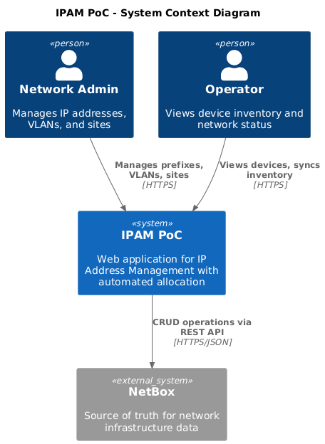
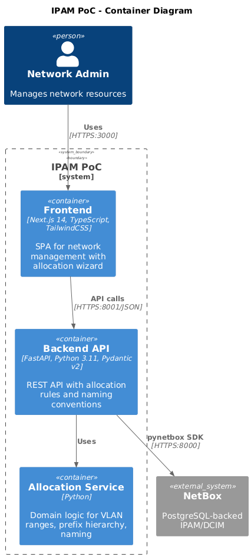
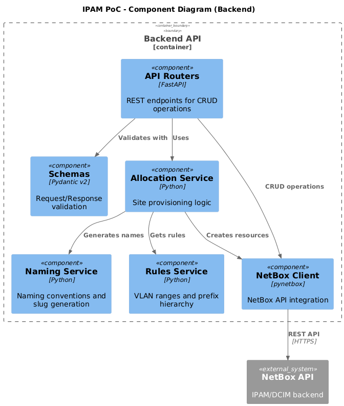
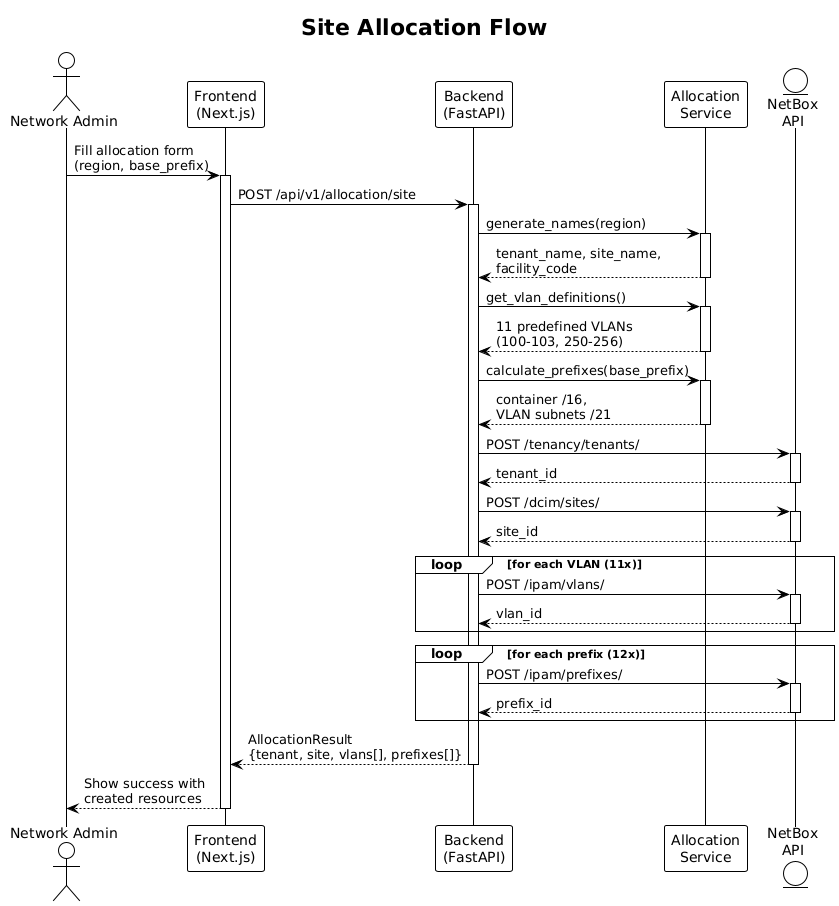
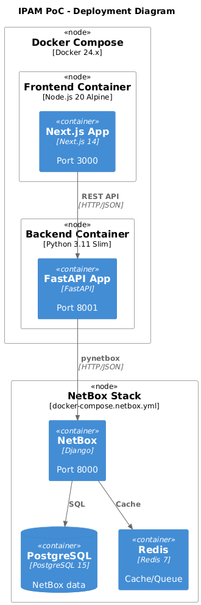

# IPAM Web Application - High-Level Design

> **Version:** 2.2
> **Date:** 2025-12-05
> **Status:** Implemented
> **Diagrams:** Rendered with [Kroki](https://kroki.io) (C4-PlantUML)

---

## 1. Architecture Overview

The IPAM Web Application follows **Clean Architecture** with a hexagonal pattern, ensuring separation of concerns and modularity. The backend uses FastAPI with sync support for simplicity, while the frontend leverages Next.js 14 App Router for modern React patterns. All data integrates with NetBox via its REST API using pynetbox.

### 1.1 System Context (C4)



### 1.2 Container Diagram (C4)



---

## 2. Technology Stack

| Layer | Technology | Version | Purpose |
|-------|------------|---------|---------|
| **Frontend** | Next.js | 14.x | React framework with App Router |
| | TypeScript | 5.x | Type safety |
| | TailwindCSS | 3.x | Styling |
| **Backend** | FastAPI | 0.115+ | REST API framework |
| | Python | 3.11+ | Runtime |
| | Pydantic | 2.x | Data validation |
| | pynetbox | 7.x | NetBox SDK |
| **Infrastructure** | Docker | 24.x | Containerization |
| | Docker Compose | 2.x | Orchestration |
| | NetBox | 4.x | IPAM backend |

---

## 3. Component Diagram (C4)



---

## 4. Data Flow - Site Allocation



---

## 5. Data Flow - Device Sync


---

## 6. Deployment Architecture (C4)



---

## 7. Domain Model

### 7.1 VLAN Allocation Rules

| Category | VID Range | Purpose |
|----------|-----------|---------|
| Management | 100-199 | mgmt, oob, bmc, pxe |
| Data | 250-299 | k8s, storage, backup |

### 7.2 Prefix Allocation Hierarchy

| Level | CIDR | Hosts | Purpose |
|-------|------|-------|---------|
| Container | /16 | 65,534 | Site aggregate |
| VLAN Subnet | /21 | 2,046 | Per-VLAN |
| Host Subnet | /26 | 62 | Per-rack |

### 7.3 Naming Conventions

| Entity | Pattern | Example |
|--------|---------|---------|
| Tenant | `br-{region}-{number}` | br-ne-1 |
| Site | `Site {Region}` | Site Nordeste |
| Facility | `{REGION}-DC-{NUMBER}` | NE-DC-01 |
| Device | `{region}-{role}-srv-{number}` | ne-db-srv-01 |

---

## 8. Security Considerations

| Aspect | Implementation |
|--------|----------------|
| Authentication | NetBox API token (planned: JWT) |
| Authorization | Planned RBAC (admin, operator, viewer) |
| API Security | CORS, Pydantic validation |
| Secrets | Environment variables |
| Device Protection | Read-only sync mode |

---

## 9. API Contract Examples

### Create Site Allocation

```http
POST /api/v1/allocation/site
Content-Type: application/json

{
  "region": "nordeste",
  "base_prefix": "10.1.0.0/16"
}
```

### Response

```json
{
  "tenant": {"id": 1, "name": "br-ne-1"},
  "site": {"id": 1, "name": "Site Nordeste", "facility": "NE-DC-01"},
  "vlans": [{"vid": 100, "name": "vlan-mgmt"}, ...],
  "prefixes": [{"prefix": "10.1.0.0/16", "status": "container"}, ...]
}
```

### List Devices (Sync)

```http
GET /api/v1/devices/
```

### Response

```json
[
  {
    "id": 1,
    "name": "ne-db-srv-01",
    "device_type_name": "PowerEdge R750",
    "role_name": "Database Server",
    "site_name": "Site Nordeste",
    "status": "active"
  }
]
```

---

## 10. Diagram Sources

All diagrams are generated from PlantUML source files using Kroki:

| Diagram | Source | Render |
|---------|--------|--------|
| C4 Context | `diagrams/c4-context.puml` | `kroki.io/c4plantuml/png` |
| C4 Container | `diagrams/c4-container.puml` | `kroki.io/c4plantuml/png` |
| C4 Component | `diagrams/c4-component.puml` | `kroki.io/c4plantuml/png` |
| C4 Deployment | `diagrams/c4-deployment.puml` | `kroki.io/c4plantuml/png` |
| Site Allocation | `diagrams/sequence-allocation.puml` | `kroki.io/plantuml/png` |
| Device Sync | `diagrams/sequence-device-sync.puml` | `kroki.io/plantuml/png` |

**Render all diagrams:**

```bash
./docs/diagrams/render-diagrams.sh
```

---

## Approval

- [x] Tech Lead - Reinaldo Saraiva
- [ ] Security Review
- [ ] DevOps Review
